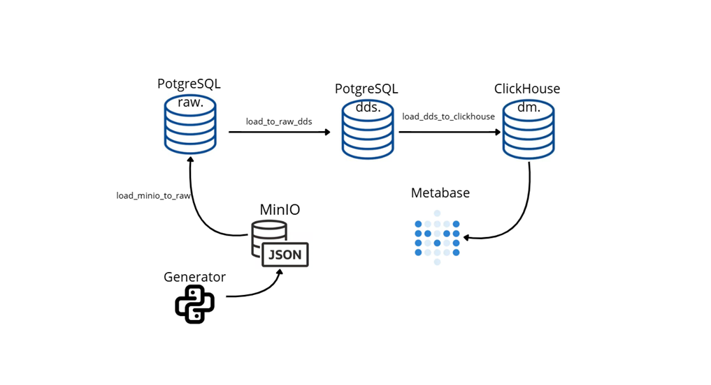
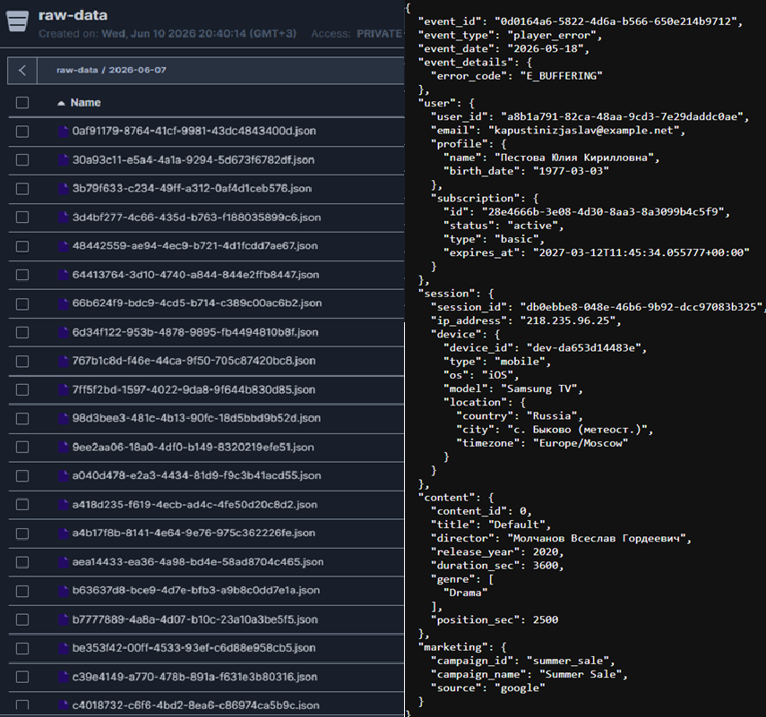
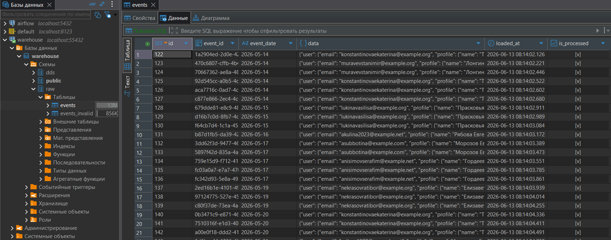
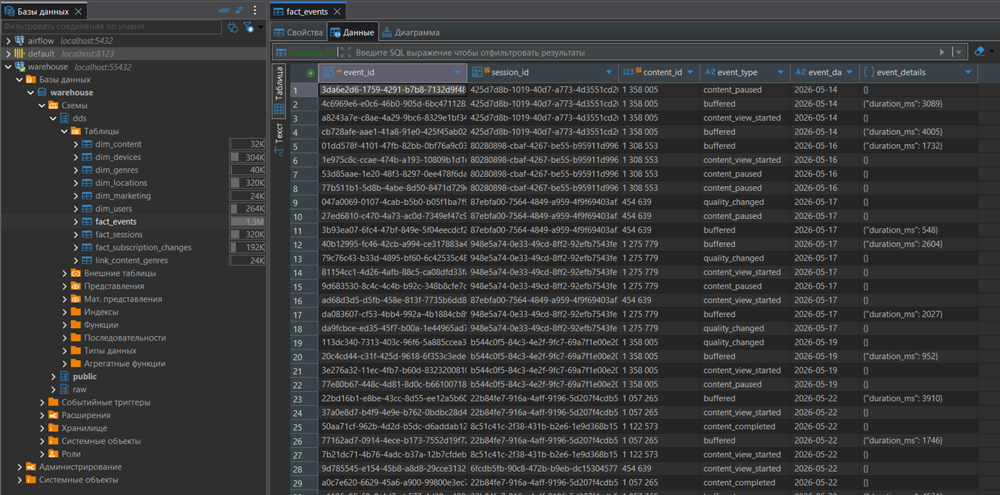
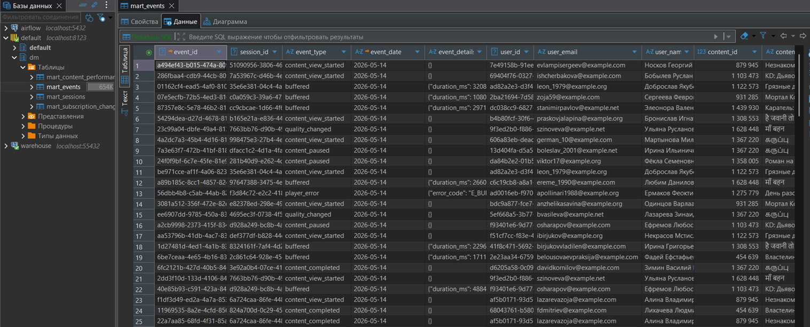
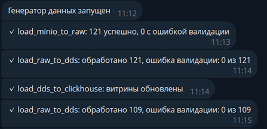
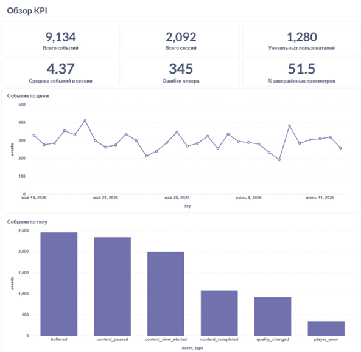
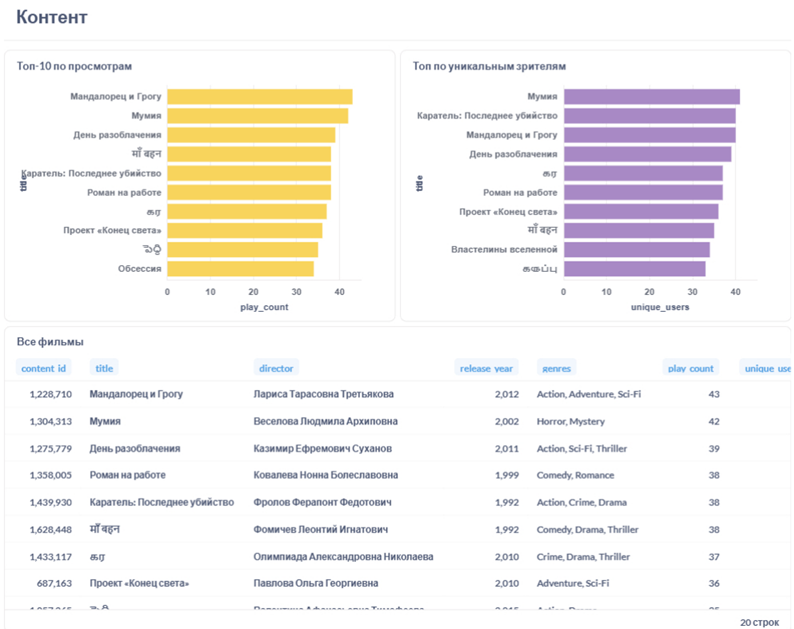
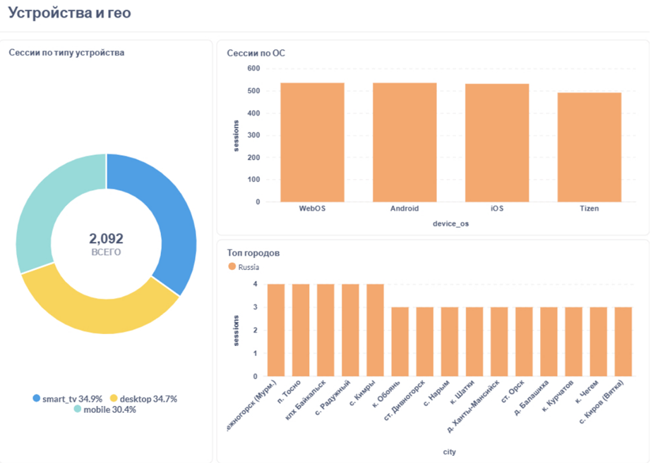
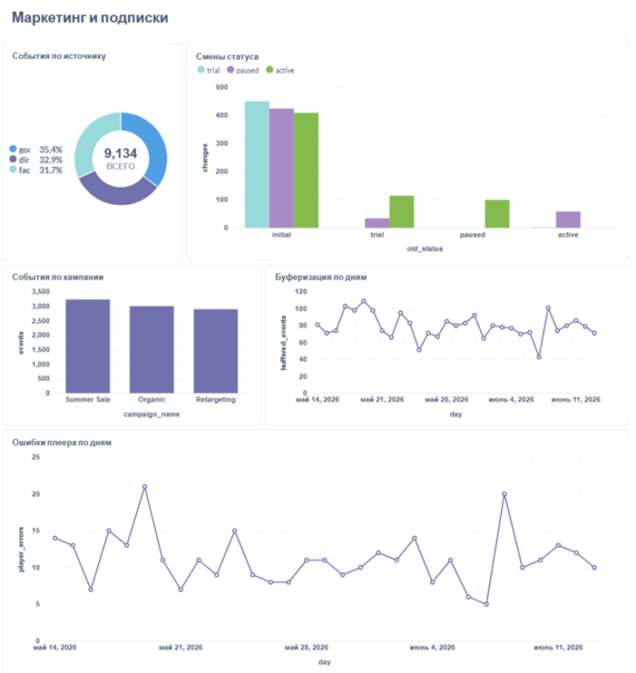

# Online Cinema ETL

**Автор:** Куприенко Владислава

____

## **Оглавление**

- [Цель проекта](#цель-проекта)
- [Источники данных](#источники-данных)
- [Архитектура](#архитектура)
- [Этапы ETL-процесса](#этапы-etl-процесса)
- [Технологический стек](#технологический-стек)
- [Пайплайн](#пайплайн)
- [Запуск проекта](#запуск-проекта)

## **Цель проекта**

Проект предназначен для сбора, обработки и визуализации данных онлайн-кинотеатра, чтобы предоставить аналитические дашборды для стримингового бизнеса. Основная цель — объединение данных из разных источников (TMDB API и синтетический генератор событий) и их трансформация через ETL-пайплайн (MinIO → PostgreSQL → ClickHouse) для аналитики активности пользователей, популярности контента, маркетинговых кампаний и подписок.

____

## **Источники данных**

| Источник | Тип | Что даёт | Как попадает в пайплайн |
|----------|-----|----------|-------------------------|
| **TMDB API** | Внешний API | Каталог фильмов: `content_id`, название, жанры | Загружается генератором при старте, обогащает события просмотра |
| **Генератор событий** | Синтетические данные | Пользователи, сессии, устройства, подписки, маркетинг, события плеера | Python-сервис `generator/` → JSON в MinIO (~1 файл/мин) |
| **MinIO** | Landing / S3 | Пакеты JSON-событий до обработки ETL | Бакет `MINIO_BUCKET`, читается DAG `load_minio_to_raw` |

**Формат данных:** JSON, одно событие на файл.  
**Периодичность:** генерация каждую минуту (по расписанию контейнера).

**Синтетически генерируются:** профили пользователей (Faker), устройства и геолокация, кампании (`google`, `facebook`, `direct`), переходы подписки (`trial` → `active` → `paused`), типы событий (`content_view_started`, `content_paused`, `content_completed`, `buffered`, `quality_changed`, `player_error`, `subscription_changed`).

**Из TMDB API:** популярные фильмы (`/movie/popular`); при недоступности API используется fallback-контент.

Для проверки качества данных генератор также создаёт ~2.5% RAW-invalid и ~2.5% DDS-invalid событий (настраивается через `RAW_INVALID_DATA_RATE` и `DDS_INVALID_DATA_RATE`).

____

## **Архитектура**



____

## **Технологический стек**

- **Docker Compose** — оркестрация сервисов
- **Python** — генератор, DAG'и, валидация (Pydantic)
- **Apache Airflow 2.8** — ETL-пайплайн
- **PostgreSQL 13** — Airflow metadata + warehouse (RAW/DDS)
- **MinIO** — S3-совместимое хранилище
- **ClickHouse** — витрины данных
- **Metabase** — дашборды
- **Telegram Bot API** — алерты о статусе пайплайна

____

## **Структура проекта**

```
├── dags/                          # Airflow DAG'и
│   ├── 1_load_minio_to_raw.py     # MinIO → PostgreSQL RAW
│   ├── 2_load_raw_to_dds.py       # RAW → DDS
│   └── 3_load_dds_to_clickhouse.py # DDS → ClickHouse dm.*
├── generator/                     # Генератор событий (TMDB + MinIO)
├── utils/
│   ├── dds_loader.py              # Загрузчик RAW → DDS
│   ├── tg_alert.py                # Telegram-уведомления
│   └── validation/
│       ├── raw_models.py          # Pydantic: этап minio → raw
│       └── dds_models.py          # Pydantic: этап raw → dds
├── postgres/init/                 # Схемы raw и dds
├── clickhouse/init/               # Схема dm и витрины
├── screens/                       # Скриншоты для README
└── docker-compose.yml
```

____

## **Этапы ETL-процесса**

| Этап | DAG | Extract | Transform | Load | Результат |
|------|-----|---------|-----------|------|-----------|
| **1. Landing → RAW** | `load_minio_to_raw` | JSON-файлы из MinIO | Валидация `RawEvent` (Pydantic) | `raw.events` / `raw.events_invalid` | Сырые события в PostgreSQL, некорректные — в карантин `[RAW]` |
| **2. RAW → DDS** | `load_raw_to_dds` | Необработанные строки из `raw.events` | `DdsLoader` + `validate_for_dds`, нормализация в dim/fact | `dds.dim_*`, `dds.fact_*` | Звёздная схема DWH; DDS-ошибки → `raw.events_invalid` `[DDS]` |
| **3. DDS → DM** | `load_dds_to_clickhouse` | JOIN и агрегация в PostgreSQL | Приведение типов, обработка NULL | `dm.mart_*` в ClickHouse | 4 аналитические витрины для BI |
| **4. Визуализация** | — | Витрины ClickHouse | SQL-запросы Metabase | Дашборды | Метрики по контенту, маркетингу, подпискам, качеству плеера |

**Оркестрация:** этапы 1 и 2 запускаются каждую минуту; этап 3 — автоматически по Airflow Dataset `DDS_UPDATED` после успешной загрузки в DDS. На каждом этапе — Telegram-алерты о результатах или ошибках.

```
MinIO → [1] raw.* → [2] dds.* → [DDS_UPDATED] → [3] dm.* → [4] Metabase
```

____

## **Пайплайн**

### 1. Генерация событий и загрузка в MinIO (Landing)

*`generator/generator.py`*

Сервис загружает каталог фильмов из **TMDB API**, генерирует синтетические события просмотра (пользователи, сессии, устройства, подписки, маркетинг) и сохраняет JSON в **MinIO** (~1 файл/мин).

**Результат:** в MinIO лежат сырые JSON-события до обработки ETL.



### 2. Загрузка в RAW (PostgreSQL)

*`1_load_minio_to_raw.py`*

DAG читает JSON из MinIO, валидирует структуру через Pydantic-модель `RawEvent` и записывает данные в PostgreSQL.

**Результат:** валидные события — в `raw.events`, ошибки — в `raw.events_invalid` с меткой `[RAW]`.



### 3. Трансформация RAW → DDS

*`2_load_raw_to_dds.py`*

DAG берёт необработанные события из `raw.events`, выполняет бизнес-валидацию (`validate_for_dds`) и загружает данные в звёздную схему PostgreSQL через `DdsLoader`.

**Результат:** нормализованные измерения `dds.dim_*` и факты `dds.fact_*`; DDS-ошибки — в `raw.events_invalid` с меткой `[DDS]`. Публикуется Dataset `DDS_UPDATED`.



### 4. Формирование витрин в ClickHouse

*`3_load_dds_to_clickhouse.py`*

DAG пересчитывает аналитические витрины в ClickHouse: агрегация и JOIN данных из DDS, приведение типов, обработка NULL.

**Результат:** витрины `dm.mart_events`, `dm.mart_sessions`, `dm.mart_content_performance`, `dm.mart_subscription_changes` готовы для Metabase.



### 5. Мониторинг пайплайна (Telegram)

*`utils/tg_alert.py`*

На каждом этапе ETL отправляются уведомления в Telegram о количестве загруженных/отклонённых записей и об ошибках.



### 6. Дашборды и метрики

**— KPI и активность платформы**

| Показатель | Что показывает |
|:-----------|:---------------|
| Количество событий | Общая активность пользователей |
| Количество сессий | Объём просмотров |
| Уникальные пользователи | Охват аудитории |
| События по типам | Паттерны поведения (play, pause, buffering…) |



**— Эффективность контента**

| Показатель | Что показывает |
|:-----------|:---------------|
| Просмотры по фильмам | Самый популярный контент |
| Уникальные зрители | Охват каждого title |
| Топ жанров | Предпочтения аудитории |
| Play count | Количество запусков просмотра |



**— Устройства и техническое качество**

| Показатель | Что показывает |
|:-----------|:---------------|
| Распределение по типам устройств | smart_tv, mobile, desktop |
| Буферизация по дням | Проблемы с качеством потока |
| Ошибки плеера | Технические сбои |



**— Маркетинг и подписки**

| Показатель | Что показывает |
|:-----------|:---------------|
| События по кампаниям | Эффективность рекламы |
| События по источникам | google, facebook, direct |
| Переходы подписки | trial → active → paused |
| Смены статуса по дням | Динамика монетизации |



____

## **Запуск проекта**

1. Клонирование репозитория

```bash
git clone https://github.com/cewson/Online-cinema-ETL-project
```

2. Создание файла `.env`

```bash
cp .env.example.txt .env
```

Заполните все переменные в `.env`.

3. Запуск docker-compose

```bash
docker compose up -d --build
```

Первый запуск может занять несколько минут (инициализация Airflow, ClickHouse, Postgres).

4. Настройка Airflow

Откройте http://localhost:8080 и создайте подключения (**Admin → Connections**):

#### `warehouse_default` (PostgreSQL)

| Поле | Значение |
|------|----------|
| Connection Type | Postgres |
| Host | `warehouse-postgres` |
| Schema | значение `POSTGRES_DB` из `.env` |
| Login / Password | `POSTGRES_USER` / `POSTGRES_PASSWORD` |
| Port | `5432` |

#### `minio_default` (Amazon Web Services)

| Поле | Значение |
|------|----------|
| Connection Type | Amazon Web Services |
| Login | `MINIO_ROOT_USER` |
| Password | `MINIO_ROOT_PASSWORD` |
| Extra | `{"endpoint_url": "http://minio:9000"}` |

5. Включение DAG'ов

В UI Airflow **включите** три DAG'а:

- `load_minio_to_raw`
- `load_raw_to_dds`
- `load_dds_to_clickhouse`

### DAG'и

| DAG | Расписание | Описание |
|-----|------------|----------|
| `load_minio_to_raw` | каждую минуту | Читает JSON из MinIO, валидирует `RawEvent`, пишет в `raw.events` |
| `load_raw_to_dds` | каждую минуту | Трансформирует `raw.events` → `dds.*`, публикует Dataset `DDS_UPDATED` |
| `load_dds_to_clickhouse` | по Dataset | Пересчитывает витрины `dm.*` в ClickHouse |

```
load_minio_to_raw → load_raw_to_dds → [DDS_UPDATED] → load_dds_to_clickhouse
```

### Валидация данных

| Этап | Модель | Ошибки в `events_invalid` |
|------|--------|---------------------------|
| minio → raw | `RawEvent` | `[RAW] ...` |
| raw → dds | `DdsInboundEvent` | `[DDS] ...` |

### Витрины ClickHouse (`dm.*`)

| Таблица | Содержание |
|---------|------------|
| `dm.mart_events` | Детальный лог событий с атрибутами user/content/device |
| `dm.mart_sessions` | Агрегация событий по сессиям |
| `dm.mart_content_performance` | Метрики просмотров по фильмам |
| `dm.mart_subscription_changes` | История смен статуса подписки |

### Сервисы и порты

| Сервис | URL / порт |
|--------|------------|
| Airflow | http://localhost:8080 |
| Metabase | http://localhost:3000 |
| MinIO Console | http://localhost:9001 |
| ClickHouse HTTP | http://localhost:8123 |
| Warehouse PostgreSQL | localhost:55432 |
