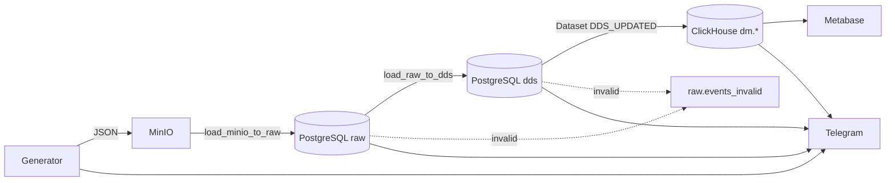

# ETL_travel_project

**Автор:** Куприенко Владислава

____

## **Оглавление**

- [Цель проекта](#цель-проекта)
- [Источники данных](#источники-данных)
- [Архитектура](#архитектура)
- [Этапы ETL-процесса](#этапы-etl-процесса)
- [Технологический стек](#технологический-стек)
- [Пайплайн](#пайплайн)
- [Запуск проекта](#запуск-проекта)

 ## **Цель проекта**

Проект предназначен для сбора, обработки и визуализации данных онлайн-кинотеатра, чтобы предоставить аналитические дашборды для стримингового бизнеса. Основная цель — объединение данных из разных источников (TMDB API и синтетический генератор событий) и их трансформация через ETL-пайплайн (MinIO → PostgreSQL → ClickHouse) для аналитики активности пользователей, популярности контента, маркетинговых кампаний и подписок.

____

## **Источники данных**

| Источник | Тип | Что даёт | Как попадает в пайплайн |
|----------|-----|----------|-------------------------|
| **TMDB API** | Внешний API | Каталог фильмов: `content_id`, название, жанры | Загружается генератором при старте, обогащает события просмотра |
| **Генератор событий** | Синтетические данные | Пользователи, сессии, устройства, подписки, маркетинг, события плеера | Python-сервис `generator/` → JSON в MinIO (~1 файл/мин) |
| **MinIO** | Landing / S3 | Пакеты JSON-событий до обработки ETL | Бакет `MINIO_BUCKET`, читается DAG `load_minio_to_raw` |

**Формат данных:** JSON, одно событие на файл.  
**Периодичность:** генерация каждую минуту (по расписанию контейнера).

**Синтетически генерируются:** профили пользователей (Faker), устройства и геолокация, кампании (`google`, `facebook`, `direct`), переходы подписки (`trial` → `active` → `paused`), типы событий (`content_view_started`, `content_paused`, `content_completed`, `buffered`, `quality_changed`, `player_error`, `subscription_changed`).

**Из TMDB API:** популярные фильмы (`/movie/popular`); при недоступности API используется fallback-контент.

Для проверки качества данных генератор также создаёт ~2.5% RAW-invalid и ~2.5% DDS-invalid событий (настраивается через `RAW_INVALID_DATA_RATE` и `DDS_INVALID_DATA_RATE`).
____

## **Архитектура**



____

## **Стек**

- **Docker Compose** — оркестрация сервисов
- **Python** — генератор, DAG'и, валидация (Pydantic)
- **Apache Airflow 2.8** — ETL-пайплайн
- **PostgreSQL 13** — Airflow metadata + warehouse (RAW/DDS)
- **MinIO** — S3-совместимое хранилище
- **ClickHouse** — витрины данных
- **Metabase** — дашборды
- **Telegram Bot API** — алерты о статусе пайплайна

____

## **Структура проекта**

```
├── dags/                          # Airflow DAG'и
│   ├── 1_load_minio_to_raw.py     # MinIO → PostgreSQL RAW
│   ├── 2_load_raw_to_dds.py       # RAW → DDS
│   └── 3_load_dds_to_clickhouse.py # DDS → ClickHouse dm.*
├── generator/                     # Генератор событий (TMDB + MinIO)
├── utils/
│   ├── dds_loader.py              # Загрузчик RAW → DDS
│   ├── tg_alert.py                # Telegram-уведомления
│   └── validation/
│       ├── raw_models.py          # Pydantic: этап minio → raw
│       └── dds_models.py          # Pydantic: этап raw → dds
├── postgres/init/                 # Схемы raw и dds
├── clickhouse/init/               # Схема dm и витрины
├── metabase/queries/              # SQL для дашбордов Metabase
└── docker-compose.yml
```


____


## **Этапы ETL-процесса**

| Этап | DAG | Extract | Transform | Load | Результат |
|------|-----|---------|-----------|------|-----------|
| **1. Landing → RAW** | `load_minio_to_raw` | JSON-файлы из MinIO | Валидация `RawEvent` (Pydantic) | `raw.events` / `raw.events_invalid` | Сырые события в PostgreSQL, некорректные — в карантин `[RAW]` |
| **2. RAW → DDS** | `load_raw_to_dds` | Необработанные строки из `raw.events` | `DdsLoader` + `validate_for_dds`, нормализация в dim/fact | `dds.dim_*`, `dds.fact_*` | Звёздная схема DWH; DDS-ошибки → `raw.events_invalid` `[DDS]` |
| **3. DDS → DM** | `load_dds_to_clickhouse` | JOIN и агрегация в PostgreSQL | Приведение типов, обработка NULL | `dm.mart_*` в ClickHouse | 4 аналитические витрины для BI |
| **4. Визуализация** | — | Витрины ClickHouse | SQL-запросы Metabase | Дашборды | Метрики по контенту, маркетингу, подпискам, качеству плеера |

**Оркестрация:** этапы 1 и 2 запускаются каждую минуту; этап 3 — автоматически по Airflow Dataset `DDS_UPDATED` после успешной загрузки в DDS. На каждом этапе — Telegram-алерты о результатах или ошибках.

```
MinIO → [1] raw.* → [2] dds.* → [DDS_UPDATED] → [3] dm.* → [4] Metabase
```
____


## **Пайплайн**

### 1. Загрузка данных в MongoDB (Raw Layer)

*fetch_data_and_load_to_mongo.py*

DAG, который обращается к API (OpenTripMap, REST Countries) и загружает «сырые» данные в MongoDB

*generate_data_and_load_to_mongo.py*

DAG, который создаёт синтетические данные (туристы, бронирования, поиски, визиты) и также пишет их в MongoDB

**Результат:** в MongoDB лежат все исходные данные (RAW слой). Таблицы: opentripmap_pois_detailed, rest_countries, synthetic_bookings, synthetic_searches, synthetic_tourists, synthetic_visits


### 2. Инициализация схем в PostgreSQL (ODS + DDS)

*init_schemas_dag.py*

DAG, который создаёт базовые схемы и таблицы в PostgreSQL (ODS и DDS слои).

**Результат:** подготовлена структура БД для загрузки данных.

### 3. Загрузка в ODS (Operational Data Store)

*load_data_to_ods_postgres.py*

DAG, который переносит данные из MongoDB → PostgreSQL (ODS слой).

Результат: данные в ODS приведены к более структурированному виду.


### 4. Трансформация ODS → DDS

*transfer_to_dds_dag.py*

DAG, который берёт данные из ODS и переносит их в DDS слой с удалением дубликатов и валидацмей данных через Pydantic

Результат: готовый слой DDS 


### 5. Формирование витрины в ClickHouse

dds_to_clickhouse_dag.py

Загружает данные из DDS в ClickHouse.

Здесь выполняется агрегация и денормализация для расчета метрик и аналитических запросов.

Результат: аналитические витрины доступны для построения дашбордов в Metabase.


### 6. Дашборды и метрики

 **- Ежедневная сводка по туристическому бизнесу**

| Показатель | Что показывает |
|:----------------|:---------|
| Общая выручка | Доход от туров |
| Количество бронирований | Общий спрос на путешествия | 
| Количество уникальных туристов | Охват аудитории (сколько людей купили) | 
| Средний чек | Средние траты туриста | 
| Конверсия поисков в брони | Эффективность платформы | 
| Количество новых туристов | Прирост клиентской базы | 


 **- Эффективность направлений**

| Показатель | Что показывает |
|:----------------|:---------|
| Выручка по странам | Самые прибыльные направления |
| Топ стран по числу бронирований | Популярность стран | 
| Средний рейтинг мест | Качество туристических объектов | 
| Топ-категории по бронированиям | Какие виды туризма популярны | 
| Средняя цена тура по стране | Доступность направлений | 


 **- Поведение туристов и вовлеченность**

| Показатель | Что показывает |
|:----------------|:---------|
| Средняя длительность поездки | Как долго туристы остаются |
| Среднее количество посещённых мест | Активность туристов | 
| Среднее количество поездок на туриста | Лояльность клиентов | 
| События (поиск/бронирование/отмена) | Паттерны поведения | 
| Среднее количество туристов за период | Удержание клиентов | 


____


## Быстрый старт

1. Клонирование репозитория

 ```bash 
git clone https://github.com/cewson/Online-cinema-ETL-project
```

2. Создание файлов .env с данными

 ```bash
.env для docker-compose
```
Заполните все переменные в .env
  
3. Запсутить docker-compose

 ```bash
docker compose up -d --build
```
Первый запуск может занять несколько минут (инициализация Airflow, ClickHouse, Postgres).

4. Настройка Airflow

Откройте http://localhost:8080 и создайте подключения (**Admin → Connections**):

#### `warehouse_default` (PostgreSQL)

| Поле | Значение |
|------|----------|
| Connection Type | Postgres |
| Host | `warehouse-postgres` |
| Schema | значение `POSTGRES_DB` из `.env` |
| Login / Password | `POSTGRES_USER` / `POSTGRES_PASSWORD` |
| Port | `5432` |

#### `minio_default` (Amazon Web Services)

| Поле | Значение |
|------|----------|
| Connection Type | Amazon Web Services |
| Login | `MINIO_ROOT_USER` |
| Password | `MINIO_ROOT_PASSWORD` |
| Extra | `{"endpoint_url": "http://minio:9000"}` |

5. Включение DAG'ов

В UI Airflow **включите** три DAG'а:

- `load_minio_to_raw`
- `load_raw_to_dds`
- `load_dds_to_clickhouse`

## DAG'и

| DAG | Расписание | Описание |
|-----|------------|----------|
| `load_minio_to_raw` | каждую минуту | Читает JSON из MinIO, валидирует `RawEvent`, пишет в `raw.events` |
| `load_raw_to_dds` | каждую минуту | Трансформирует `raw.events` → `dds.*`, публикует Dataset `DDS_UPDATED` |
| `load_dds_to_clickhouse` | по Dataset | Пересчитывает витрины `dm.*` в ClickHouse |

Цепочка триггеров:

```
load_minio_to_raw → load_raw_to_dds → [DDS_UPDATED] → load_dds_to_clickhouse
```

## Валидация данных

Два независимых этапа контроля качества:

| Этап | Модель | Ошибки в `events_invalid` |
|------|--------|---------------------------|
| minio → raw | `RawEvent` | `[RAW] ...` |
| raw → dds | `DdsInboundEvent` | `[DDS] ...` |

Генератор намеренно создаёт ~2.5% RAW-invalid и ~2.5% DDS-invalid событий (настраивается в `.env`).

## Витрины ClickHouse (`dm.*`)

| Таблица | Содержание |
|---------|------------|
| `dm.mart_events` | Детальный лог событий с атрибутами user/content/device |
| `dm.mart_sessions` | Агрегация событий по сессиям |
| `dm.mart_content_performance` | Метрики просмотров по фильмам |
| `dm.mart_subscription_changes` | История смен статуса подписки |

